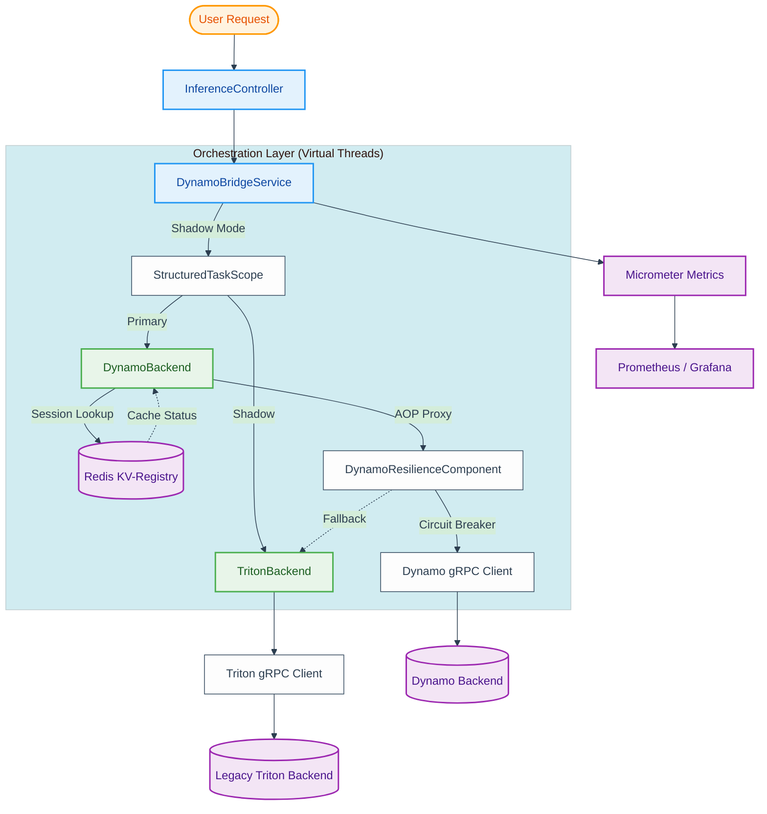
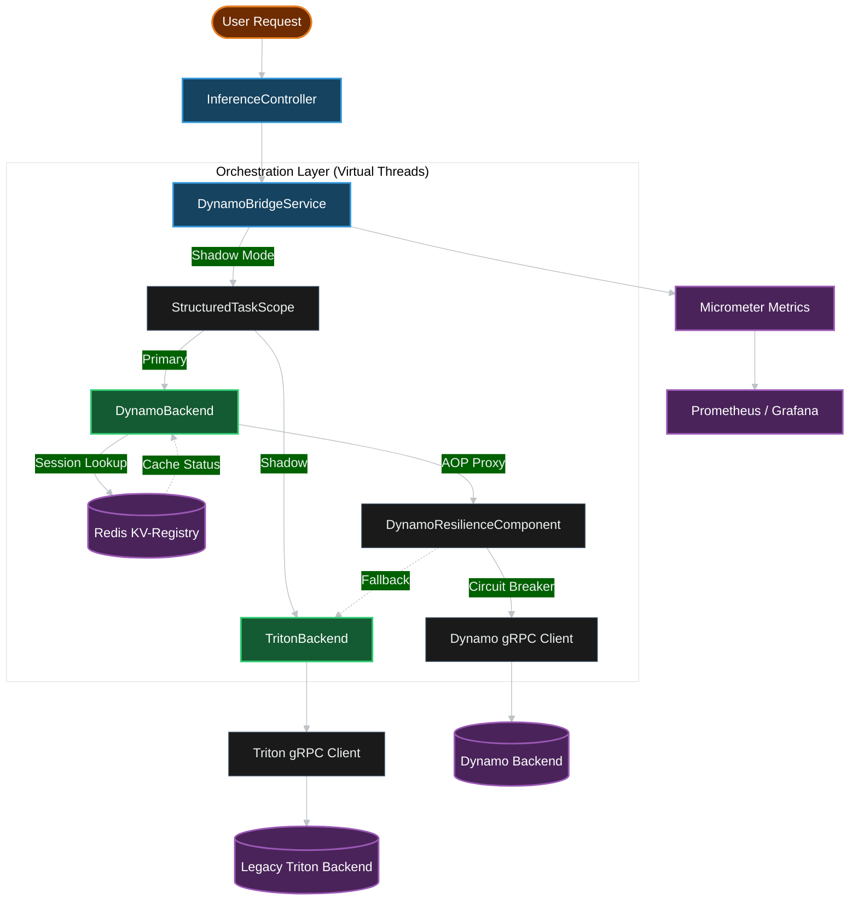

# Velo-Sentinel

> High-performance Java 25 Virtual Thread-based inference gateway serving as the critical bridge for transitioning from legacy NVIDIA Triton to the **NVIDIA Dynamo 1.0** disaggregated inference framework.

## Mission
To provide a **foundational computational platform** for high-scale ML/AI applications, serving as the critical orchestration layer for transitioning from legacy NVIDIA Triton to the next-generation **NVIDIA Dynamo** disaggregated inference framework.

## Key Objectives
- **Research-to-Production Bridge**: Streamlines the deployment of large foundation models (LLMs) by abstracting the complexity of disaggregated inference backends.
- **Scalable Orchestration Layer**: A sophisticated model serving system providing foundational abstractions that ensure consistency across distributed inference nodes.
- **High-Throughput Execution**: Leveraging **Java 25 Virtual Threads** (Project Loom) to achieve L5-tier concurrency, enabling high-traffic model serving with minimal overhead.
- **Cost & Latency Optimization**: Integrated **Adaptive Batching** and **SLA-Aware Priority Queuing** (EDF) to maximize GPU utilization and minimize inference costs.
- **Production-Grade Resilience**: Multi-layered fault tolerance (Fail-Open/Closed) and circuit breakers to maintain high availability in business-critical environments.
- **Enterprise Observability**: Proactive logging and telemetry via **OpenTelemetry** and **Micrometer**, providing deep visibility into the research-to-production lifecycle.
- **Stateful Consistency**: Global session tracking via **Redis** to ensure context-aware routing for generative AI workloads.

## Architecture
Velo-Sentinel follows modern high-performance architectural patterns, prioritizing **Structured Concurrency** over legacy Reactive patterns.

### Architecture Diagram

<details open>
<summary>☀️ View Architecture (Light Mode)</summary>


</details>

<details>
<summary>🌙 View Architecture (Dark Mode)</summary>


</details>

### Resilience Features
- **DynamoResilienceComponent**: Isolated resilience layer using Resilience4j `@CircuitBreaker`. Decouples fault tolerance from orchestration logic.
- **Fail-Open Path**: Automatic fallback to legacy Triton ensures 100% availability during migration.
- **AOP-Aware Proxying**: Fixed internal proxying issues via component isolation.

### KV-Cache Management
- **Global Session Registry**: Leveraging **Redis** as a disaggregated KV-Cache registry to track session "Warmth" across the cluster.
- **Context-Aware Routing**: The gateway identifies "Cold" sessions and pre-emptively triggers KV-Cache hydration in the Dynamo backend, eliminating cold-start latency for the user.
- **Distributed State**: Ensures that stateless Virtual Threads can rapidly re-associate users with their specific model context without expensive lookups.

## Technology Stack
- **Language**: Java 25 (Optimized for Virtual Threads)
- **Framework**: Spring Boot 4.0.5
- **Resilience**: Java 25 Structured Concurrency & Scoped Values
- **Observability**: Micrometer (Registry-based metrics)
- **Communication**: gRPC (Primary) & HTTP/REST (Legacy/Compatibility)
- **Inference Backend**: NVIDIA Dynamo-Triton
- **Serialization**: Protocol Buffers (Protobuf)
- **Infrastructure**: Docker & Docker Compose

## Project Structure
```text
.
├── benchmarks/       # Performance testing and latency metrics
├── gateway/          # Java/Spring Boot Gateway Implementation
│   └── sentinel/     # Gradle project root
├── python/           # Python utilities and model scripts
├── triton-client/    # Client utilities and testing scripts
├── infra/            # Infrastructure configuration (Triton, Docker)
```

## Getting Started

### Prerequisites
- JDK 25
- Spring Boot 4
- Docker & Docker Compose
- Gradle 8.x (provided via wrapper)

### Running the Environment
1. **Start NVIDIA Dynamo-Triton**:
   ```bash
   cd infra
   docker compose up -d
   ```
2. **Build and Run the Gateway**:
   ```bash
   cd gateway/sentinel
   ./gradlew bootRun
   ```

## Resilience & Chaos Simulation
Velo-Sentinel is hardened with a dedicated `DynamoResilienceComponent` to handle fault tolerance.

### Running Chaos Simulation
1. Start the gateway in DYNAMO mode:
   ```bash
   ./gradlew bootRun --args='--spring.profiles.active=dev --velo.sentinel.routing-mode=DYNAMO'
   ```
2. Trigger Fail-Open (Simulate Dynamo Backend Crash):
   Use a session ID starting with `chaos-fail` to trigger a hard error in the Mock server.
   ```bash
   curl -X POST http://localhost:8080/infer -H "Content-Type: application/json" -d '{"sessionId": "chaos-fail-01", "value": 10}'
   ```
   *Expected Result*: Status `SUCCESS`, prediction `10.0` (Fallback to Triton).

3. Trigger SLO Veto (Simulate High Latency):
   Use a session ID starting with `chaos-slow` in SHADOW mode.
   ```bash
   ./gradlew bootRun --args='--spring.profiles.active=dev --velo.sentinel.routing-mode=SHADOW'
   curl -X POST http://localhost:8080/infer -H "Content-Type: application/json" -d '{"sessionId": "chaos-slow-01", "value": 10}'
   ```
   *Expected Result*: Status `SUCCESS`, prediction `10.0` (Triton Ground Truth). Check logs for `SHADOW-VETO`.

### Failover Strategies
Velo-Sentinel implements a layered resilience model. Every failure scenario has a defined, tested fallback path — no request should ever receive an unhandled error.

| Scenario | Condition | Failover Behavior |
|---|---|---|
| **Dynamo Backend Crash** | `DYNAMO` or `SHADOW` mode; Dynamo gRPC throws | `DynamoResilienceComponent` circuit breaker trips → fall back to **Triton** |
| **Triton Ground Truth Loss** | `SHADOW` mode; Triton `StructuredTaskScope` fails or times out | Fall back to **Dynamo** as a best-effort prediction (avoids retrying a known-broken backend) |
| **Redis KV-Cache Outage** | `KVCacheRegistry` throws `RedisConnectionFailureException` | **Fail-Open** → treat every session as Cold Start; inference continues at slightly higher latency |
| **Total System Outage** | Both Dynamo and Triton backends are unreachable | **Fail-Closed** → returns `503 Service Unavailable` with `BACKEND_OUTAGE` status code |
| **Batching Failure** | `AdaptiveBatcher` timeout or processor exception | Fall back to a **direct, individual** `protectedDynamoCall` |
| **SLA Deadline Exceeded** | Task sits in priority queue past its `PriorityTier` SLA | **SLA-Veto**: task is dropped with `TimeoutException`; GPU cycles are not wasted |

#### Failover Decision Tree (Shadow Mode)
```
SHADOW request received
    └─ Triton scope succeeds?
        ├─ YES → return Triton result; compare Dynamo async (zero latency impact)
        └─ NO  → Dynamo best-effort via resilienceComponent
                    └─ Dynamo also fails?
                        └─ resilienceComponent circuit breaker → Triton direct call
```


### Metrics & Observability
- **KV-Cache Hits**: `sentinel:session:<id>` in Redis.
- **Drift**: `curl http://localhost:8080/actuator/metrics/velo.sentinel.shadow.drift`
- **SLO Vetoes**: `curl http://localhost:8080/actuator/metrics/velo.sentinel.shadow.timeout`
- **Error Rates**: `curl http://localhost:8080/actuator/metrics/velo.sentinel.errors`
- **Distributed Tracing (Jaeger)**: Access the UI at [http://localhost:16686](http://localhost:16686) to visualize `VeloInference` spans.

#### Local Tracing Configuration
If you do not want to run Jaeger, you can redirect traces to the console log by setting an environment variable:
```bash
export OTEL_TRACES_EXPORTER=logging
./gradlew bootRun
```

### Testing SLA-Aware Priority Queuing
You can inject the optional `priority` field into your payload to test the dynamic deadline resolution:
```bash
# High Priority (REALTIME SLA: 100ms)
curl -X POST http://localhost:8080/infer -H "Content-Type: application/json" \
  -d '{"sessionId": "realtime-user", "value": 42, "priority": "REALTIME"}'

# Low Priority (BACKGROUND SLA: 5000ms)
curl -X POST http://localhost:8080/infer -H "Content-Type: application/json" \
  -d '{"sessionId": "batch-job-1", "value": 42, "priority": "BACKGROUND"}'
```

## Intellectual Property
This project was designed and implemented by `velo.com` as a technical demonstration of high-performance system architecture. All architectural decisions, performance optimizations, and code implementations are original work.
