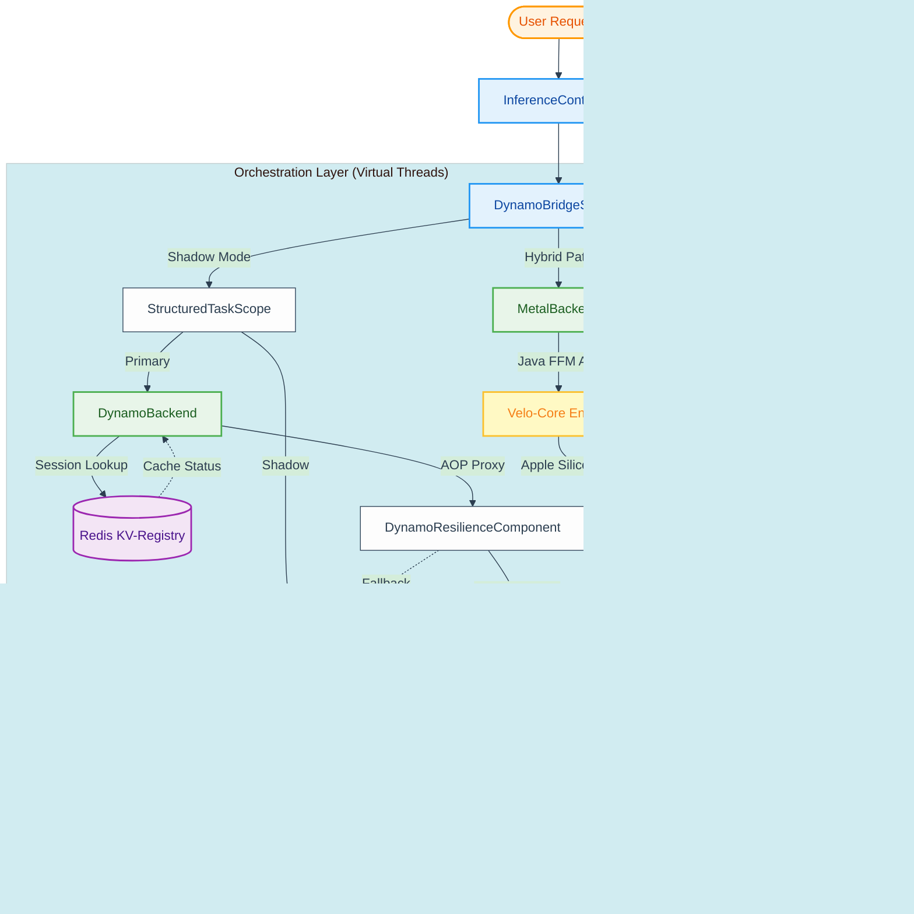
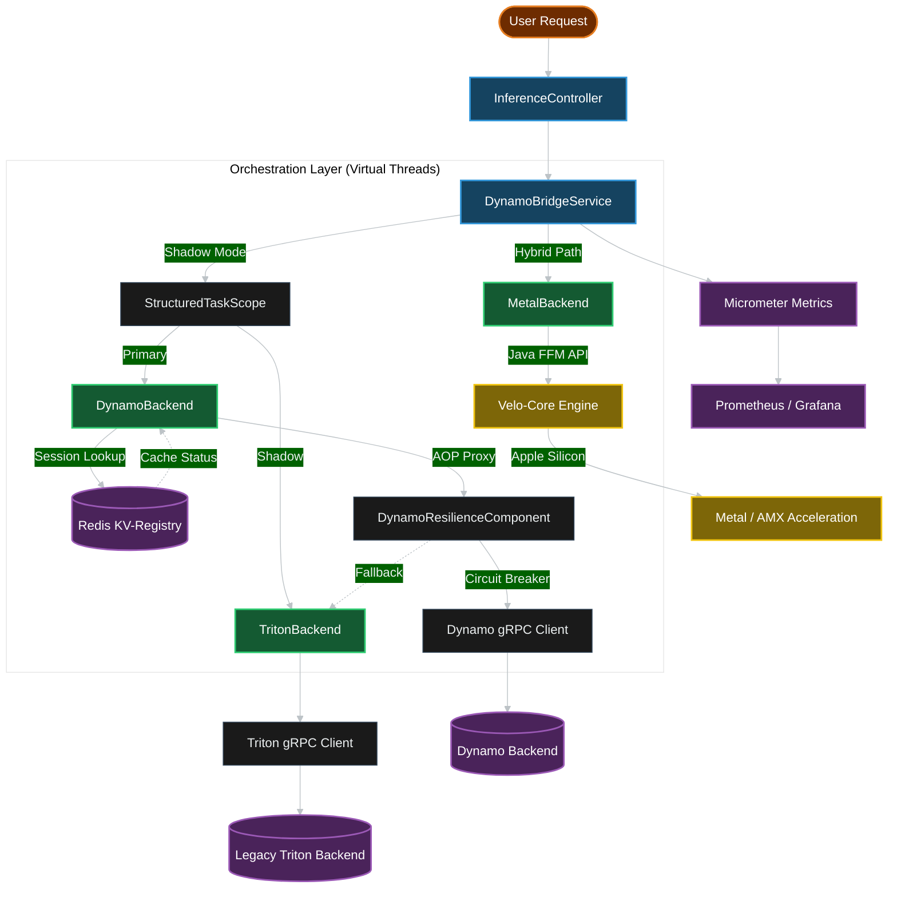

# Velo-Sentinel

> **Velo-Sentinel**: A high-performance inference gateway designed for Tier-1 AI organizations. Built on **Java 25 Virtual Threads**, it serves as the mission-critical orchestration layer for transitioning from legacy [NVIDIA Triton](https://github.com/triton-inference-server/server) to the next-generation [NVIDIA Dynamo 1.x](https://github.com/ai-dynamo/dynamo) disaggregated inference framework.

## 🚀 Tier-1 Readiness Dashboard
The following features are production-ready. Click the links for detailed documentation.

| Phase | Focus |
| :--- | :--- |
| **Concurrency** | **[🏗️ Architecture & Disaggregated Serving](gateway/sentinel/docs/DISAGGREGATED_SERVING.md)** — Prefill/Decode separation and cache-aware routing.<br>**[🏛️ Deep-Dive Architecture](gateway/sentinel/docs/ARCHITECTURE.md)** — Internal component breakdown and thread model.<br>**[📊 Observability & Metrics](gateway/sentinel/docs/OBSERVABILITY.md)** — Micrometer, Jaeger tracing, and Prometheus. |
| **Resilience** | **[🛡️ Resilience & Chaos Engineering](gateway/sentinel/docs/RESILIENCE.md)** — Circuit breakers, hedging, and fault injection.<br>**[🌍 Multi-Cloud Disaster Recovery](gateway/sentinel/docs/DISASTER_RECOVERY.md)** — Cross-cloud failover strategies. |
| **Efficiency** | **[⚖️ Adaptive Batching Strategies](gateway/sentinel/docs/BATCHING.md)** — Optimizing TFLOPS via intelligent request grouping.<br>**[⚡ SLA-Aware Priority Queuing](gateway/sentinel/docs/PRIORITY_QUEUING.md)** — Dynamic deadline resolution and priority-based scheduling.<br>**[⚙️ NVIDIA Dynamo-Aware Scaling](gateway/sentinel/docs/SCALING.md)** — Predictive HPA and backend pressure metrics. |
| **Governance** | **[🔐 Enterprise Governance & Privacy](gateway/sentinel/docs/GOVERNANCE.md)** — PII scrubbing, authentication, and audit logging.<br>**[🔒 Security & Authentication](gateway/sentinel/docs/SECURITY.md)** — API Key management and endpoint protection. |
| **Hardware** | **[🚀 Performance & Benchmarks](gateway/sentinel/docs/PERFORMANCE.md)** — Latency results and hardware-specific optimizations **[Velo-Core](https://github.com/developertogo/velo-core)**. |

## Mission
To provide a **foundational computational platform** for global-scale ML/AI applications, bridging the gap between legacy infrastructure and disaggregated, hardware-aware serving through the **Four Pillars of Inference Scale**: Concurrency, Resilience, Efficiency, and Governance.

---

## Key Objectives
- **Research-to-Production Bridge**: Streamlines the deployment of large foundation models (LLMs) by abstracting the complexity of disaggregated inference backends.
- **Scalable Orchestration Layer**: A sophisticated model serving system providing foundational abstractions that ensure consistency across distributed inference nodes.
- **High-Throughput Execution**: Leveraging **Java 25 Virtual Threads** (Project Loom) to achieve L5-tier concurrency, enabling high-traffic model serving with minimal overhead.
- **Speculative Acceleration**: Orchestrating multi-model "Draft & Verify" workflows to achieve superior token-generation speeds.
- **Cost & Latency Optimization**: Integrated **Adaptive Batching**, **SLA-Aware Priority Queuing**, and **Semantic Caching** to maximize GPU utilization.
- **Production-Grade Resilience**: Multi-layered fault tolerance (Fail-Open/Closed), **Request Hedging**, and **Multi-Cloud Disaster Recovery**.
- **Enterprise Governance**: Proactive privacy protection via **PII Scrubbing** and **Immutable Audit Logging** for regulatory compliance.
- **Safety & Observability**: Real-time **Accuracy Drift Monitoring** and **Shadow-Mode Validation** to ensure model parity during migration.
- **Hybrid Hardware Orchestration**: Seamlessly routing between Cloud GPUs and **Local Metal/AMX acceleration** ([Velo-Core](https://github.com/developertogo/velo-core)) for edge-aware inference.

## Architecture
Velo-Sentinel follows modern high-performance architectural patterns, prioritizing **Structured Concurrency** over legacy Reactive patterns.

### Architecture Diagram

<details open>
<summary>☀️ View Architecture (Light Mode)</summary>


</details>

<details>
<summary>🌙 View Architecture (Dark Mode)</summary>


</details>

### KV-Cache Management
- **Global Session Registry**: Leveraging **Redis** as a disaggregated KV-Cache registry to track session "Warmth" across the cluster.
- **Context-Aware Routing**: The gateway identifies "Cold" sessions and pre-emptively triggers KV-Cache hydration in the Dynamo backend, eliminating cold-start latency for the user.
- **Distributed State**: Ensures that stateless Virtual Threads can rapidly re-associate users with their specific model context without expensive lookups.

### High-Performance Orchestration
- **Disaggregated Serving**: Optimizes throughput by separating **Prefill** (compute-bound) and **Decode** (memory-bound) phases into distinct batching streams.
- **Sticky Cache Routing**: Minimizes data transfer latency by directing requests to GPU nodes that already host the relevant **KV-Cache** in memory.
- **Request Hedging**: Eliminates P99 latency outliers by automatically spawning parallel "hedged" requests if the primary backend stutters.
- **Semantic Caching**: Reduces GPU load by >40% by returning cached results for semantically similar prompts using vector-based lookup.
- **Velo-Core Integration**: Velo-Sentinel acts as the primary gateway for [Velo-Core](https://github.com/developertogo/velo-core), a specialized Rust/C++ inference engine. This enables sub-millisecond latency for local workloads.

---

## Technology Stack
- **Language**: Java 25 (Optimized for Virtual Threads)
- **Framework**: Spring Boot 4.0.5
- **Resilience**: Java 25 Structured Concurrency & Scoped Values
- **Observability**: Micrometer (Registry-based metrics)
- **Communication**: gRPC (Primary) & HTTP/REST (Legacy/Compatibility)
- **Inference Backend**: NVIDIA Dynamo-Triton
- **Infrastructure**: Docker & Docker Compose

## Project Structure
```text
.
├── gateway/          # Java/Spring Boot Gateway Implementation
├── sdks/             # Multi-language SDKs (Python, Node.js, Java)
├── scripts/          # Automation scripts (SDK gen, deployment)
├── infra/            # Infrastructure configuration (Docker, Kubernetes)
└── core/             # High-performance Metal/AMX kernels (C++/MSL)
```

## Getting Started

### Prerequisites
- JDK 25
- Docker & Docker Compose
- Gradle 8.x (provided via wrapper)

### Running the Environment
1. **Start NVIDIA Dynamo-Triton**:
   ```bash
   cd infra
   docker compose up -d
   ```
2. **Build and Run the Gateway**:
   ```bash
   cd gateway/sentinel
   ./gradlew bootRun
   ```

3. **Generate Multi-Language SDKs**:
   ```bash
   ./scripts/sdk-gen.sh
   ```
   This generates high-performance clients in `sdks/python`, `sdks/node`, and `sdks/java`.

4. **Generate API Documentation (Javadoc)**:
   ```bash
   # For the Gateway
   cd gateway/sentinel && ./gradlew javadoc
   
   # For the Java SDK
   cd sdks/java && ./gradlew javadoc
   ```
   *Output: `build/docs/javadoc/index.html` in respective modules.*

5. **Verify System Integrity (Tests & Coverage)**:
   ```bash
   cd gateway/sentinel
   ./gradlew clean test build
   ```
   Generate test coverage report (Jacoco):
   ```bash
   ./gradlew test jacocoTestReport
   ```
   The report URL is: `file:///${PWD}/gateway/sentinel/build/reports/jacoco/test/html/index.html`
   The unit test coverage is **>84%**.

---

## Intellectual Property
This project was designed and implemented by `velo.com` as a technical demonstration of high-performance system architecture. All architectural decisions, performance optimizations, and code implementations are original work.
