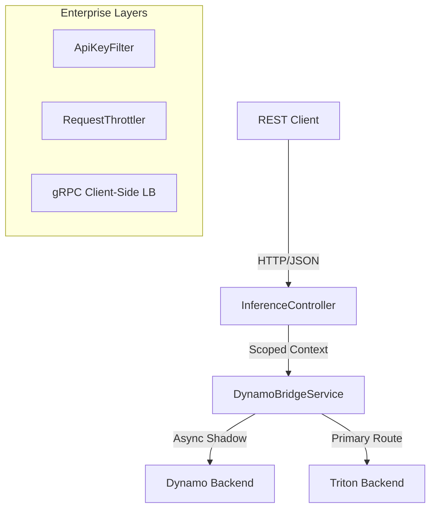

# Velo-Sentinel System Architecture

Velo-Sentinel is a high-performance gRPC-based inference gateway designed to bridge the gap between traditional web applications and next-generation AI model servers (Dynamo/Triton).

## 🏛️ High-Level Design

The gateway follows a **Reactive-Style Asynchronous** architecture built on **Java 25 Virtual Threads**.

## 💎 Core Components

### 1. Inference Gateway (REST/JSON)
The entry point for all inference requests. It handles JSON serialization, input validation, and session context initialization.

### 2. Adaptive Batcher
A background component that prioritizes and batches incoming requests. It ensures that interactive sessions receive lower latency than background batch sessions.

### 3. Dynamo Bridge Service
The orchestration layer. It manages:
*   **Routing Policies**: `DYNAMO`, `TRITON`, or `SHADOW`.
*   **Shadow Mode**: Runs Dynamo in parallel with Triton for "Silent Validation" without impacting client latency.
*   **Resilience**: Circuit breakers and fail-open logic.

### 4. Enterprise Security & SLA
*   **Spring Security Filter Chain**: Protects the gateway edge.
*   **Per-Session Throttling**: Enforces resource quotas.

## 🚀 Performance Optimizations
*   **Virtual Threads**: Allows the gateway to handle thousands of concurrent requests with minimal memory overhead.
*   **gRPC Multiplexing**: Highly efficient binary protocol for backend communication.
*   **Headless DNS Discovery**: Real-time service discovery for auto-scaling GPU clusters.
