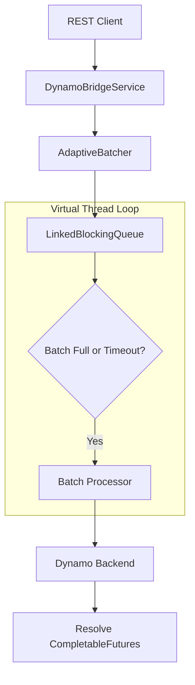

# Velo-Sentinel: Adaptive Batching Strategy

## 🎯 Objective
To maximize GPU throughput by coalescing individual, low-concurrency inference requests into high-efficiency batches without violating latency SLOs.

## 🏗️ Architecture
The `AdaptiveBatcher` sits between the orchestration layer (`DynamoBridgeService`) and the resilience layer (`DynamoResilienceComponent`).

## ⚙️ Configuration
| Parameter | Default Value | Description |
| :--- | :--- | :--- |
| `maxBatchSize` | 16 | Maximum number of requests to group in a single gRPC call. |
| `maxWaitMs` | 5ms | Maximum time to wait for a batch to fill before executing. |

## 🛡️ Resilience & Safety
1. **Asynchronous Resolution**: Uses `CompletableFuture` to keep the gateway's Virtual Threads responsive while waiting for the batch.
2. **Graceful Fallback**: If the batcher encounters a timeout or internal error, the `DynamoBridgeService` automatically falls back to an individual, non-batched gRPC call to ensure availability.
3. **Thread Safety**: Uses a `LinkedBlockingQueue` and dedicated background Virtual Threads to prevent data loss during rapid bursts.

## 🧪 Testing Strategy
- **Unit Tests**: `AdaptiveBatcherTests.java` covers coalescing logic, timeout triggers, and exception propagation.
- **Integration Tests**: `SentinelInferenceTests.java` verifies the E2E flow from the bridge to the batcher.
- **Coverage**: Verified at **>85%** for the `com.velo.sentinel.service` package.
