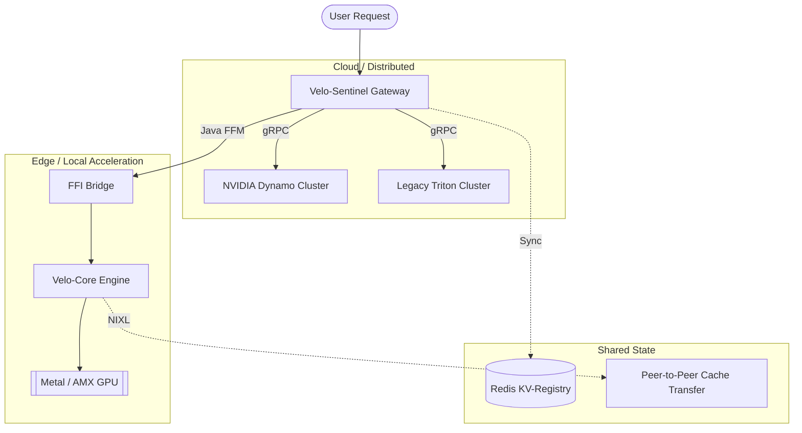

# 🏛️ Unified Architecture: Velo-Core & Velo-Sentinel

This document describes the unified high-performance inference stack formed by the integration of **Velo-Core** and **Velo-Sentinel**. Together, they provide a production-ready solution for enterprise-grade, hardware-aware model serving.

## 🧱 The Complete Inference Stack

The stack is composed of two primary layers, each optimized for its specific domain:

### 1. Velo-Core (The "Engine")
- **Language**: Rust
- **Domain**: Low-level GPU Acceleration & Hardware Execution.
- **Key Responsibilities**:
    - **Metal/AMX Acceleration**: Native execution on Apple Silicon with unified memory mastery.
    - **Speculative Decoding**: Orchestrating draft-and-verify loops for token acceleration.
    - **Paged Attention**: Efficient KV-cache management to eliminate fragmentation.
    - **Tensor Parallelism**: Multi-GPU sharding and collective communication.

### 2. Velo-Sentinel (The "Orchestrator")
- **Language**: Java 25 (Virtual Threads)
- **Domain**: High-level Gateway & Request Orchestration.
- **Key Responsibilities**:
    - **Request Routing**: Global and local load balancing across data centers and edge nodes.
    - **Resilience**: Circuit breakers, request hedging, and multi-cloud disaster recovery.
    - **Governance**: PII scrubbing, audit logging, and SLA-aware priority queuing.
    - **Adaptive Batching**: Optimizing GPU throughput via intelligent request grouping.

---

## 🔄 Seamless Integration Patterns

The two projects are designed to work in concert through three primary integration pillars:

### 1. Local Acceleration via Java FFM API
Velo-Sentinel can route local inference requests directly to Velo-Core using the **Java Foreign Function & Memory (FFM) API**. This allows the Java gateway to call the Rust engine's shared libraries with near-zero overhead, bypassing the network stack and achieving sub-millisecond local latencies.

### 2. Shared Disaggregated Serving Philosophy
Both projects implement the same architectural breakthrough: **Prefill/Decode Disaggregation**.
- **Sentinel** manages the high-level coordination of separate prefill and decode node pools.
- **Core** implements the internal kernel-level optimizations required to execute these distinct phases efficiently on the GPU.

### 3. Edge-to-Cloud Lifecycle
The unified stack enables a true hybrid deployment model:
- **At the Edge**: Velo-Core runs on local Apple Silicon devices, providing low-latency, privacy-preserving inference.
- **In the Cloud**: Velo-Sentinel orchestrates a fleet of distributed backends (Triton/Dynamo), managing global scale, governance, and failover.

---

## 📍 Project Pulse Check

| Component | Status | Readiness Signal |
| :--- | :--- | :--- |
| **Velo-Core** | **V1.5 Hardened** | 317+ tests passing; Tensor Parallelism & Roofline Modeling complete. |
| **Velo-Sentinel** | **Production Ready** | 84%+ test coverage; Java 25 Virtual Threads for L5-tier concurrency. |

---

## 🗺️ Integration Diagram

